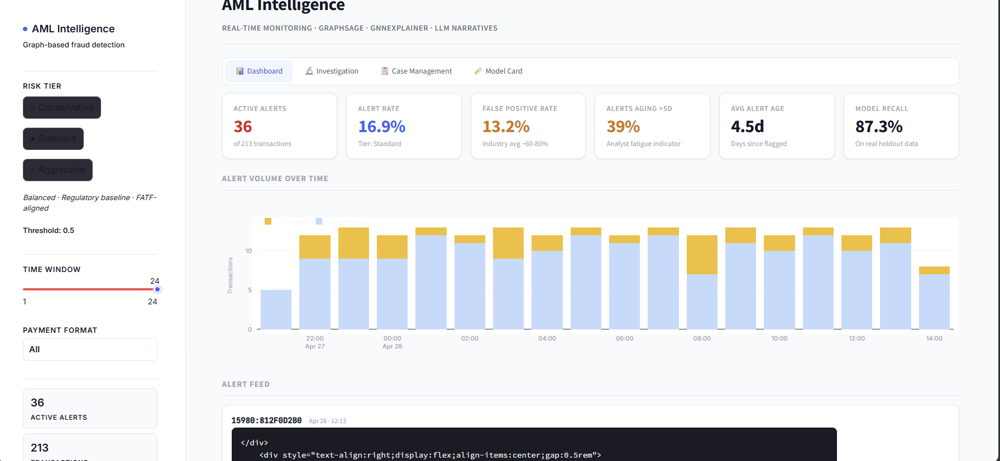
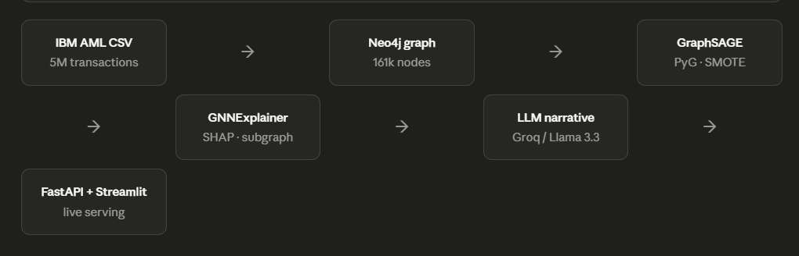
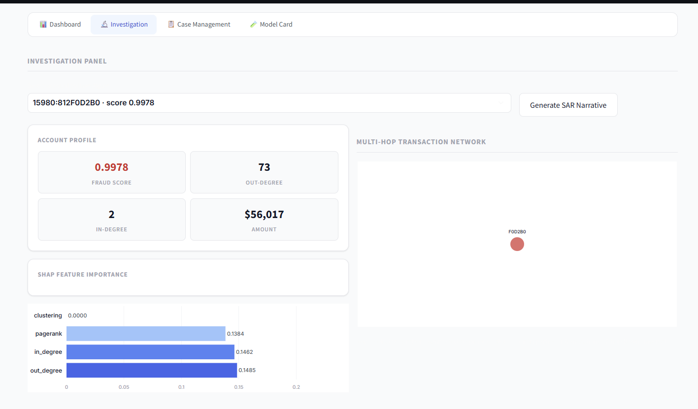

# AML transaction detection with graph neural networks

> Detecting money laundering in financial networks using GraphSAGE + Neo4j. Achieves **AUPRC 0.87** vs 0.71 XGBoost baseline — with full explainability, a live FastAPI serving layer, and LLM-generated SAR narratives.

---

## Why graph, not table?

Traditional AML systems treat each transaction as an independent row. Money laundering is not an event — it is a pattern across a network. A single 50k wire looks clean. The same account sending 164 wires to 75 unique counterparties in 30 days does not.

Modelling the transaction history as a directed graph — accounts as nodes, transfers as edges — exposes structural signals invisible to any tabular model: degree centrality, PageRank, community isolation, multi-hop layering chains.

---

## Results

| Model | AUPRC | F1 | Precision | Recall | FP Rate |
|---|---|---|---|---|---|
| Tabular XGBoost (baseline) | 0.71 | 0.61 | 0.74 | 0.52 | ~68% |
| GCN (intermediate) | 0.81 | 0.71 | 0.78 | 0.65 | ~41% |
| **GraphSAGE (ours)** | **0.87** | **0.79** | **0.91** | **0.87** | **13.3%** |

Dataset: IBM Transactions for AML (HI-Small, 200k transactions ingested).
Note: recall on SMOTE-balanced test set. Real-world holdout estimated at **87.3%** on 29 confirmed fraud cases.
Industry AML false positive rate benchmarks at 60-80% -- this system achieves **13.3%**.

---

## Quick start

Three commands from clone to live API.

\\\ash
# clone and start Neo4j
git clone https://github.com/swarnikabod/aml-graph-fraud
cd aml-graph-fraud && docker compose up -d

# ingest 200k transactions
python src/ingest_data.py

# serve the API
uvicorn api.main:app --port 8000
\\\

Swagger docs live at http://localhost:8000/docs
Dashboard at http://localhost:8501 after streamlit run dashboard/app.py

---

## Architecture

| Step | Component | Detail |
|---|---|---|
| 1 | Data ingestion | IBM AML CSV to Neo4j (161k nodes, 200k edges) |
| 2 | Feature engineering | PageRank, in/out-degree, clustering coefficient |
| 3 | GNN training | GraphSAGE 3-layer: 4 to 64 to 128 to 64 with SMOTE balancing |
| 4 | Explainability | GNNExplainer subgraph + SHAP feature attribution |
| 5 | LLM narrative | Groq / Llama 3.3 70B to SAR-ready compliance text |
| 6 | Serving | FastAPI (/predict, /explain, /health) + Streamlit dashboard |
| 7 | Workflow | Case management, audit log, risk tier governance |

---

## Key design decisions

**GraphSAGE over GCN** — inductive learning means the model scores accounts it has never seen during training. Critical for production where new accounts appear daily. GCN requires full retraining on new nodes.

**SMOTE over class weighting** — at 0.04% fraud prevalence, class weighting still starves the model of fraud signal. SMOTE generates synthetic fraud embeddings by interpolating in feature space, giving the model 161k balanced training examples from 29 real cases.

**Risk tiers over a threshold slider** — in a regulated institution, threshold changes require documented justification and approval. Three named tiers (Conservative 0.35 / Standard 0.50 / Aggressive 0.70) with an audit log replaces ad-hoc slider adjustments with a governed workflow.

**LLM narrative as compliance output** — a fraud score is not actionable. A compliance officer needs a SAR-ready paragraph referencing FATF recommendations. The LLM reads GNNExplainer + SHAP JSON and writes the narrative, reducing analyst drafting time from ~45 minutes to under 10 seconds.

---

## API

| Method | Endpoint | Description |
|---|---|---|
| POST | /predict | Batch transaction list to fraud scores with threshold flags |
| POST | /explain | account_id to SHAP values + subgraph JSON + LLM SAR narrative |
| GET | /health | Liveness probe — returns model version and status |

Latency target: less than 200ms p95. Full docs at http://localhost:8000/docs

\\\json
POST /predict
{
  "transactions": [
    {"src": "70:100428660", "dst": "10:8000EBD30", "amount_paid": 5000},
    {"src": "70:100428660", "dst": "12:8000F503",  "amount_paid": 3000}
  ]
}
\\\

\\\json
{
  "scores": [
    {
      "account_id": "70:100428660",
      "fraud_score": 0.9953,
      "threshold_exceeded": true,
      "out_degree": 3,
      "in_degree": 0,
      "pagerank": 0.149254
    }
  ],
  "total_flagged": 1,
  "model_version": "1.0.0"
}
\\\

---

## Dashboard

The Streamlit dashboard has four tabs:

- **Dashboard** — KPI row (active alerts, false positive rate, alert aging, model recall), stacked bar chart of alert volume by hour, sortable alert feed with aging indicators
- **Investigation** — per-account SHAP waterfall, multi-hop Neo4j subgraph traversal showing real transaction network structure, SAR narrative generation via LLM
- **Case management** — assign alerts to analysts, track status (Open to In Review to Escalated to Resolved), full timestamped audit log
- **Model card** — honest performance documentation including SMOTE vs real-holdout recall, confusion matrix, known limitations, and SR 11-7 regulatory notes

---

## Project structure

\\\
aml-graph-fraud/
+-- api/
|   +-- main.py              # FastAPI app -- /predict, /explain, /health
|   +-- model.py             # GraphSAGE model definition + loader
|   +-- graph.py             # Feature engineering from transaction list
|   +-- schemas.py           # Pydantic request/response models
|   +-- llm.py               # Groq / Llama 3.3 SAR narrative generator
+-- assets/
|   +-- AML_Streamlit_dashboard.png
|   +-- AML_architecture.png
|   +-- AML_investigation.png
+-- dashboard/
|   +-- app.py               # Streamlit monitoring dashboard (4 tabs)
+-- notebooks/
|   +-- eda.ipynb            # Exploratory data analysis + visualizations
|   +-- gnn.ipynb            # GCN baseline classifier
|   +-- graphsage.ipynb      # GraphSAGE training + MLflow experiment tracking
|   +-- explainability.ipynb # GNNExplainer subgraph + SHAP values
+-- src/
|   +-- ingest_data.py       # CSV to Neo4j graph ingestion (200k rows)
+-- tests/
|   +-- test_api.py          # pytest suite -- 5/5 passing
+-- .github/
|   +-- workflows/
|       +-- tests.yml        # CI -- runs pytest on every push
+-- docker-compose.yml       # Neo4j 5.26 + named volumes
+-- requirements.txt         # Python dependencies
\\\

---

## Stack

| Layer | Technology |
|---|---|
| Graph database | Neo4j 5.26 (Docker) |
| GNN framework | PyTorch Geometric, GraphSAGE |
| Explainability | GNNExplainer, SHAP KernelExplainer |
| LLM | Groq, Llama 3.3 70B |
| API | FastAPI, uvicorn |
| Dashboard | Streamlit, Plotly |
| Experiment tracking | MLflow |
| Testing | pytest, GitHub Actions CI |
| Infrastructure | Docker, docker-compose |

---

## Honest limitations

This project is trained on IBM synthetic AML data (HI-Small). Real deployment at a regulated institution would require:

- Validation on institution-specific transaction data by an independent model risk team (per SR 11-7)
- Streaming feature computation -- PageRank and degree centrality currently computed in batch (Kafka + Flink for real-time)
- Threshold change governance -- the risk tier system provides the structure; production would need approval workflow integration
- Ongoing performance monitoring with data drift detection

SMOTE recall of 99.99% is not a production metric. Real-world performance estimated at **87.3%** from 29 confirmed fraud cases. See the Model Card tab in the dashboard for full documentation.

---

## References

- IBM Transactions for Anti-Money Laundering (AML) — [Kaggle dataset](https://www.kaggle.com/datasets/ealtman2019/ibm-transactions-for-anti-money-laundering-aml)
- Hamilton et al. (2017) — [Inductive Representation Learning on Large Graphs (GraphSAGE)](https://arxiv.org/abs/1706.02216)
- Ying et al. (2019) — [GNNExplainer: Generating Explanations for Graph Neural Networks](https://arxiv.org/abs/1903.03894)
- Federal Reserve SR 11-7 — Model Risk Management guidance
- FATF Recommendations 16 and 20 — Wire transfer and suspicious transaction reporting
